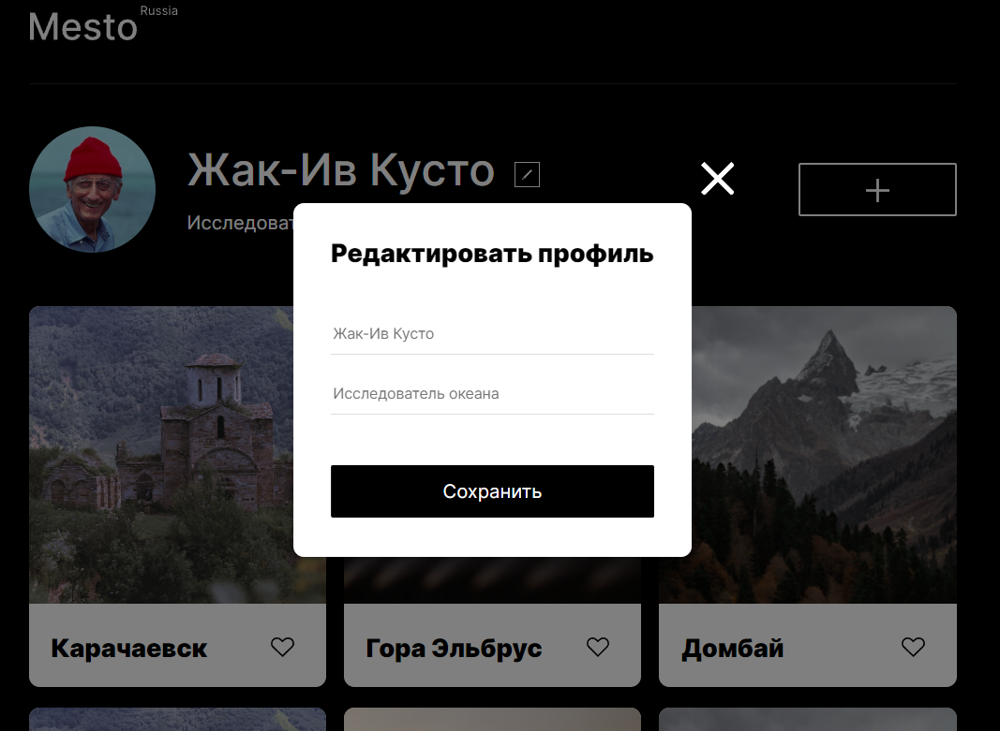

# Project: Mesto Russia
test
This is a 4th project from a [Yandex Practicum](https://practicum.yandex.ru/) web dev course. Here I have to take my project and refactor it into **React-based project**.

## Table of contents

- [Overview](#overview)
  - [Screenshot](#screenshot)
  - [Links](#links)
- [My Process](#my-process)
  - [Built with](#built-with)
  - [What I learned](#what-i-learned)
  - [Useful resourses](#useful-resouces)
- [Author](#author)

## Overview

### Screenshot

### Links

- Link to Live Site: [Github Pages](https://zang3tsu88.github.io/mesto-react/)

## My process

### Built with:

- Figma
- Semantic HTML5 markup
- CSS custom properties
- Flexbox
- Grid
- JavaScript Basics and DOM manipulation
- API requests
- React functional components
- React Hooks
- create-react-app

### What I learned

In this sprint I was intruduced to [React](react.dev) library and its basics like useState and useEffect hooks.

### Useful resouces

[Create React App](https://create-react-app.dev/) - Official Facebook app to work create React projects.

[Vite](https://vitejs.dev/) -Newer alternative to CRA.

If you want more help with writing markdown, we'd recommend checking out [The Markdown Guide](https://www.markdownguide.org/) to learn more.

[Typograph](https://www.artlebedev.ru/typograf/) helps to put normal quotes (“Christmas trees” and “paws”) instead of inch signs, kill extra spaces, change hyphens to dashes in the right places, “attach” all short conjunctions and prepositions to the words following them with an inseparable space and produce a bunch other operations.

[TinyPNG](https://tinypng.com/) helps compress and optimize images.

## Author

- Github - [@zang3tsu88](https://github.com/zang3tsu88)
